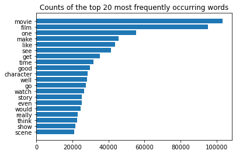

#  Sentiment Analysis of IMDb Movie Reviews:  Training a binary classification model to predict positive and negative reviews

In this project, I have performed sentiment analysis on a labelled IMBb movie reviews dataset and trained a binary classification model to identify whether the movie review is positive or negative. 

## Data Source 

 For my model, I have used the IMDb Movie Review dataset, obtained from Kaggle. It was originally developed by Mass, Daly et al (2011) original paper: [Learning Word Vectors for Sentiment Analysis]('https://ai.stanford.edu/~amaas/data/sentiment'). The dataset was created by scraping reviews data from IMDb website. It contains 50,000 reviews, with no more than 30 reviews per movie. The dataset has an even number of positive and negative reviews i.e. 25,000 each. Only highly polarized reviews were considered and neutral reviews are not part of this dataset. 

 ## Methodology

I used a TF-IDF vectorizer to quantify the relative importance of each word occurring in the reviews with respect to all words occurring in all reviews, and then uses these scores to train a binary classification model. However, before applying the TF-IDF vectorizer, I cleaned the data to:
1. Remove punctuations and special characters
2. Remove stop words (common words that don't carry a significant meaning). For this, I used Natural Language ToolKit (NLTK) stop words corpus in Python
3. Lemmatize all words using spaCy Lemmatizer.

I then created Feature vectors from the final clean version of this dataset. 

For the final classification model, I applied and evaluated three models: 
1. Multinomial Naive-Bayes
2. Logistic Regression
3. Neural Networks (Multilayer Perceptron Classifier)
4. Random Forest
5. K-Nearest Neighbors

Each of the models selected have strengths that make them suitable for training feature vectors for text classification. For example, while naive bayes models are efficient and simple to implement on TF-IDF vectorization, they assume independence between the features, whereas the words in the corpus are likely not independent. Logistic regression was selected as it does not assume independence between different features.

  

## Conclusion

 Based on the scores, the logistic regression model have the best performance on the test set, with neural network performing second best. Multi-nomial naive bayes also performs only marginally worse than the neural networks. The K-Nearest Neighbors was the lowest performing.

| Model | Accuracy on Test Set |
| --- | --- |
| Multinomial Naive Bayes | 86.13% |
| Logistic Regression | 89.29% |
| Random Forest | 85.29% | 
| Neural Network | 86.35% |
| K Nearest Neighbor | 78.9% |

Neural networks have the ability to capture hidden complex and intricate patterns and relationships between different features. However, since logistic regression performs better than the neural network, it may be that the relationships between features are relatively simpler to be captured by the simpler model that is logistic regression as opposed to the more complex neural network. Secondly, Naive Bayes may not have performed as well as logistic regression as it assumes independence between the features.

In conclusion, logistic regression was selected due to its high performance on the test set.
